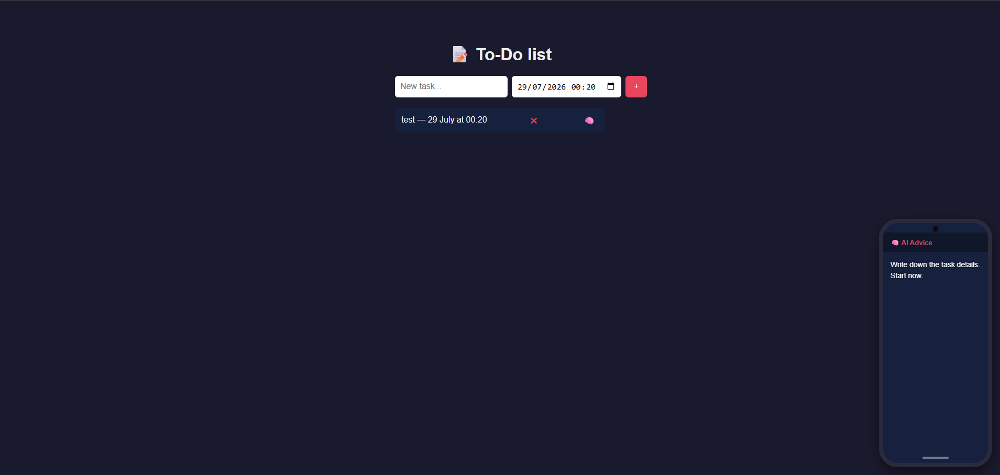

# AI To-Do List

I built this to-do app while learning full-stack development — it combines task management with AI-generated advice to help you actually start a task, not just track it.

## Live Demo
[todo-ai-c8rm.onrender.com](https://todo-ai-c8rm.onrender.com)

## Features
- Add and delete tasks with deadlines
- AI advice button on each task — sends a request to a custom `/ask-ai` endpoint, which calls the Groq API (llama-3.3-70b-versatile) for a short, actionable suggestion
- Responses match the user's browser language automatically
- Deadline reminders — checks every 10 seconds and triggers a browser notification when a task is due within 60 minutes
- Works as a PWA — installable, with offline caching via a Service Worker
- Tasks are saved in localStorage, so no backend database is needed for this version
- Loading state and error handling on the AI request, both on the client and server side

## Tech Stack
- Frontend: HTML, CSS, JavaScript
- Backend: Node.js, Express
- AI: Groq API (llama-3.3-70b-versatile)
- Deployed on Render

## Running Locally

Clone the repository:
```bash
git clone https://github.com/DmytroGetman/todo-ai.git
cd todo-ai
```

Install dependencies:
```bash
npm install
```

Create a `.env` file in the project root:
```
GROQ_API_KEY=your_groq_api_key
```

Start the server:
```bash
node server.js
```

Open `http://localhost:3000` in your browser.

## Project Structure
```
index.html      - main HTML structure
style.css       - styling, including the phone-frame advice UI
script.js       - task rendering, event listeners, fetch calls
server.js       - Express server, Groq API integration
sw.js           - Service Worker for offline caching
manifest.json   - PWA config
package.json    - dependencies
```

## What I'd Add Next
- Validation to stop empty tasks from being added
- A real database instead of localStorage
- Editing existing tasks
- Preventing duplicate AI requests if the button is clicked too fast

## Screenshot

